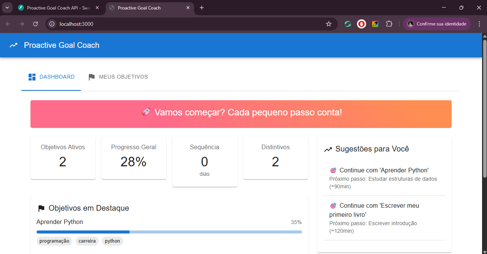
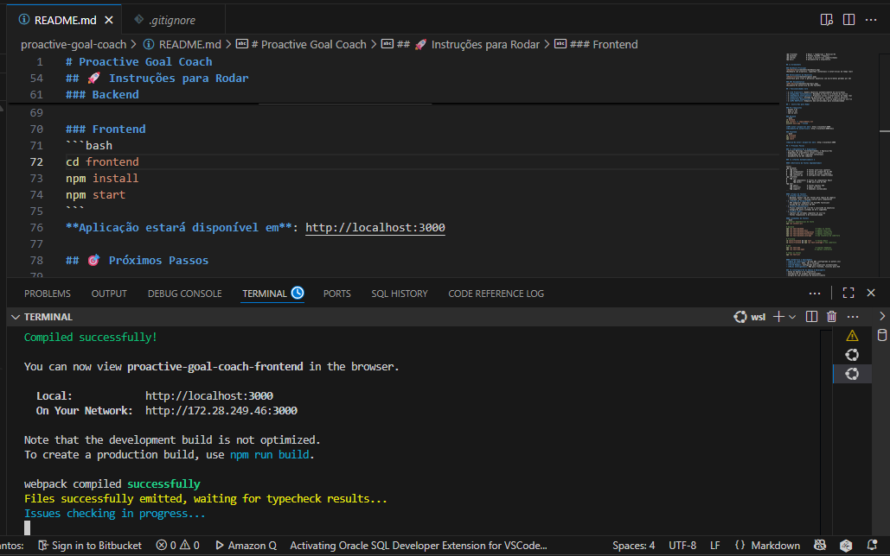
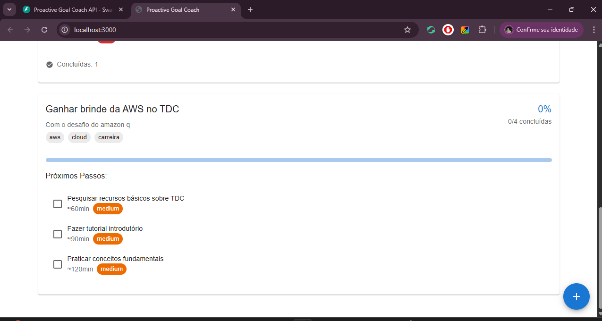
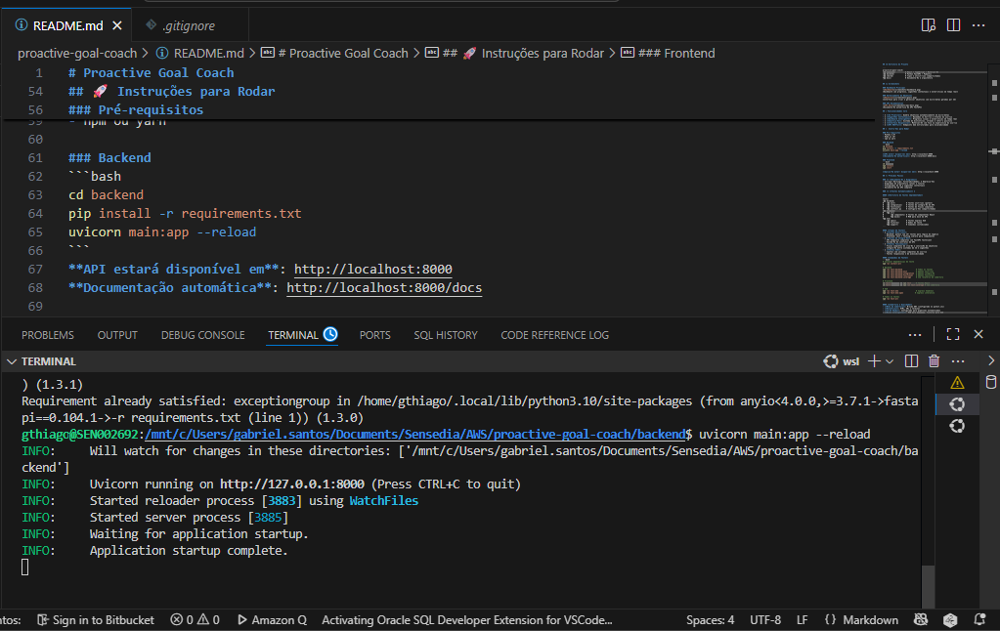
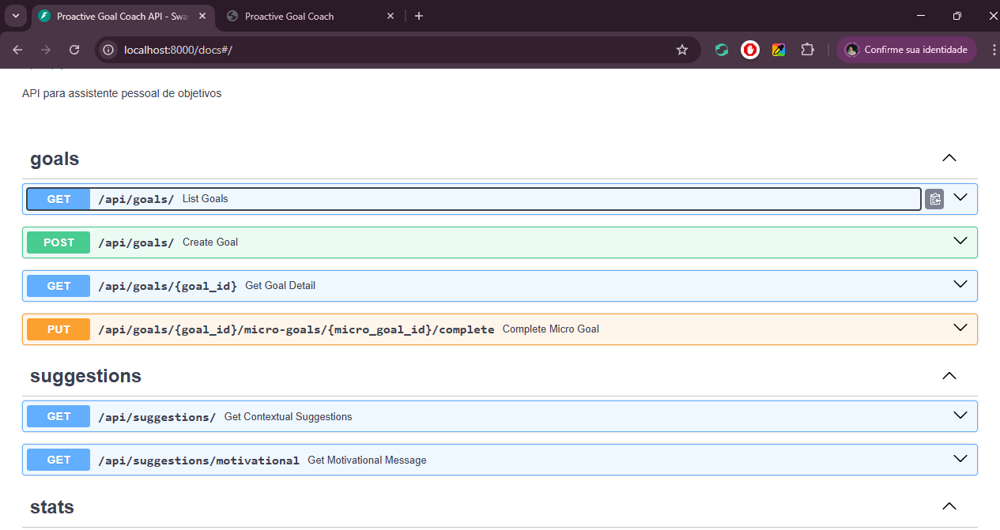

# Proactive Goal Coach


Um assistente pessoal inteligente que ajuda usuários a atingir objetivos de longo prazo através de micro-metas e sugestões contextuais.

> 🏆 **Projeto desenvolvido para Q Developer Quest TDC 2025** - Demonstrando IA integrada, arquitetura serverless e boas práticas de desenvolvimento.

## 💡 Qual Problema Inspirou a Ideia

Pensando em listas de afazeres pessoais e como normalmente trabalho, sempre coloco subtarefas para tornar grandes objetivos mais acessíveis. Na vida, olhar para passos menores facilita a realização. 

A ideia inicial era criar um to-do simples com Amazon Q, porém, como utilizamos IA, pensei: "Por que não ter automaticamente as subtarefas?". Às vezes recorremos ao ChatGPT para quebrar tarefas complexas - que tal já ter isso integrado no sistema, ajudando proativamente a realizar objetivos?

## 🛠️ Como a Solução Foi Construída

Em conversas sobre projetos, gerei alguns prompts para o Amazon Q sobre a ideia, compartilhando como pensei, exemplos e sacadas. Desde o início, estruturei bem para ter frontend e backend separados, pensando em tornar serverless futuramente, seguindo boas práticas e possibilidades de melhoria.

O Amazon Q sugeriu e trouxe:
- **Frontend**: React com TypeScript (componentização fácil)
- **Backend**: Python FastAPI (rápido, bem documentado, fácil migração serverless)
- **Arquitetura**: RESTful com IA para insights e sugestões contextuais
- **Dados**: Mocks funcionais desde o início para desenvolvimento ágil

## 📁 Estrutura do Projeto

```
proactive-goal-coach/
├── frontend/          # React + TypeScript + Material-UI
├── backend/           # Python FastAPI + Pydantic
├── shared/            # Tipos e utilitários compartilhados
└── docs/              # Documentação e arquitetura
```

## 📸 Screenshots

### Tela Inicial

*Interface principal do Proactive Goal Coach em funcionamento*

### Frontend - Dashboard

*Dashboard com progresso, sugestões contextuais e estatísticas em tempo real*

### Inserção de Meta

*Criação de novo objetivo com micro-metas geradas automaticamente pela IA*

### Backend em Execução

*Terminal mostrando o servidor FastAPI rodando com logs em tempo real*

### Documentação OpenAPI

*Documentação automática da API com Swagger UI*

## ✨ Funcionalidades Core

- ✅ **IA Proativa**: Quebra objetivos automaticamente em micro-metas
- ✅ **Sugestões Contextuais**: Baseadas no horário e hábitos do usuário
- ✅ **Dashboard Inteligente**: Progresso visual e estatísticas em tempo real
- ✅ **Gamificação**: Sistema de distintivos, streaks e reforço positivo
- ✅ **Interface Responsiva**: Material-UI com foco na experiência do usuário
- ✅ **API RESTful**: Endpoints bem estruturados para escalabilidade

## 🚀 Instruções para Rodar

### Pré-requisitos
- Python 3.9+
- Node.js 16+
- npm ou yarn

### Backend
```bash
cd backend
pip install -r requirements.txt
uvicorn main:app --reload
```
**API estará disponível em**: http://localhost:8000
**Documentação automática**: http://localhost:8000/docs

### Frontend
```bash
cd frontend
npm install
npm start
```
**Aplicação estará disponível em**: http://localhost:3000

## 🎯 Próximos Passos

### 📊 **Documentação e Diagramas**
- Corrigir Warnings; Vulnerabilidades; e Depreciações
- Diagramas de arquitetura (atual e futura)
- Fluxogramas de IA e sugestões contextuais
- Documentação de API completa

### 🧪 **Testes Automatizados** ✅

#### **Estrutura de Testes Implementada**
```
tests/
├── backend/
│   ├── unit/           # Testes unitários (pytest)
│   ├── integration/    # Testes de integração de API
│   ├── functional/     # Testes de fluxos completos
│   └── conftest.py     # Configurações compartilhadas
├── frontend/
│   └── src/
│       ├── components/ # Testes de componentes React
│       └── mocks/      # MSW para mock de API
└── e2e/
    ├── specs/          # Testes Cypress E2E
    ├── fixtures/       # Dados de teste
    └── support/        # Comandos customizados
```

#### **Tipos de Teste**
- ✅ **Testes Unitários**: 
  - Backend: pytest com 15+ testes para lógica de negócio
  - Frontend: Jest + Testing Library para componentes
- ✅ **Testes de Integração**: 
  - API endpoints completos com FastAPI TestClient
  - Validação de contratos de API
- ✅ **Testes Funcionais**: 
  - Fluxos completos de criação e conclusão de objetivos
  - Integração entre sistemas de IA e sugestões
- ✅ **Testes E2E**: 
  - Cypress com jornadas completas do usuário
  - Testes responsivos e de acessibilidade

#### **Comandos de Teste**
```bash
# Instalar dependências de teste
npm run install:all

# Backend
npm run test:backend              # Todos os testes
npm run test:backend:unit         # Apenas unitários
npm run test:backend:integration  # Apenas integração
npm run test:backend:functional   # Apenas funcionais
npm run test:backend:coverage     # Com relatório de cobertura

# Frontend
cd tests/frontend && npm test     # Testes React
cd tests/frontend && npm run test:coverage # Com cobertura

# E2E
npm run test:e2e                  # Cypress headless
npm run test:e2e:open            # Cypress interativo

# Todos os testes
npm run test:all
```

#### **Cobertura e Qualidade**
- **Meta de Cobertura**: Mínimo 80% (configurado no pytest.ini)
- **Relatórios**: HTML, XML e terminal
- **CI/CD Ready**: Configurado para pipelines automatizados
- **Mocks Inteligentes**: MSW para frontend, fixtures para E2E

### 🤖 **Configuração do Amazon Q Developer**
- Setup do Amazon Q no repositório
- Configuração de prompts personalizados
- Integração com workflows de desenvolvimento
- Documentação de melhores práticas com Q

### ☁️ **Infraestrutura como Código (IaC)**
- **Terraform**: Provisionamento completo da AWS
- **AWS CDK**: Alternativa em Python/TypeScript
- **CloudFormation**: Templates para recursos específicos
- **CI/CD Pipeline**: GitHub Actions + AWS CodePipeline

### 🔌 **Integração MCP (Model Context Protocol)**
- Implementação de conectores MCP
- Integração com ferramentas externas
- Contexto enriquecido para IA
- Plugins personalizáveis

### 💰 **Estimativa de Custo AWS (Serverless)**

#### **Tier Gratuito (Primeiros 12 meses)**
- Lambda: 1M requests/mês grátis
- DynamoDB: 25GB storage grátis
- API Gateway: 1M calls/mês grátis
- S3: 5GB storage grátis
- CloudFront: 50GB transfer grátis

#### **Estimativa Mensal (após tier gratuito)**
- **Lambda**: ~$0.20 (1M execuções)
- **DynamoDB**: ~$1.25 (1GB dados + reads/writes)
- **API Gateway**: ~$3.50 (1M requests)
- **S3 + CloudFront**: ~$0.50 (hosting estático)
- **EventBridge**: ~$1.00 (scheduling)

**Total estimado**: ~$6.45/mês para 1M requests

#### **Escalabilidade**
- **10M requests/mês**: ~$35/mês
- **100M requests/mês**: ~$200/mês
- **Otimizações**: Reserved capacity, caching, compression

---

#### **Métricas de Qualidade**
- 📊 **Cobertura de Código**: >80% (backend e frontend)
- 🧪 **Testes Implementados**: 25+ testes automatizados
- ⚡ **Performance**: Testes executam em <30 segundos
- 🔄 **CI/CD Ready**: Scripts preparados para automação

---

**Desenvolvido com Amazon Q Developer** 🤖